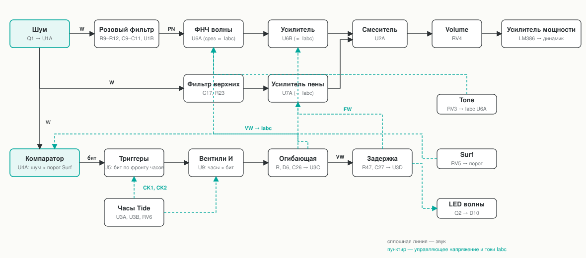
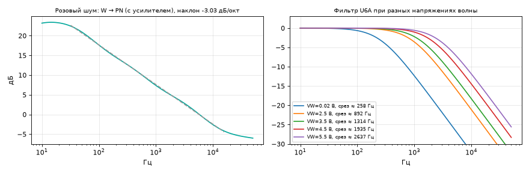
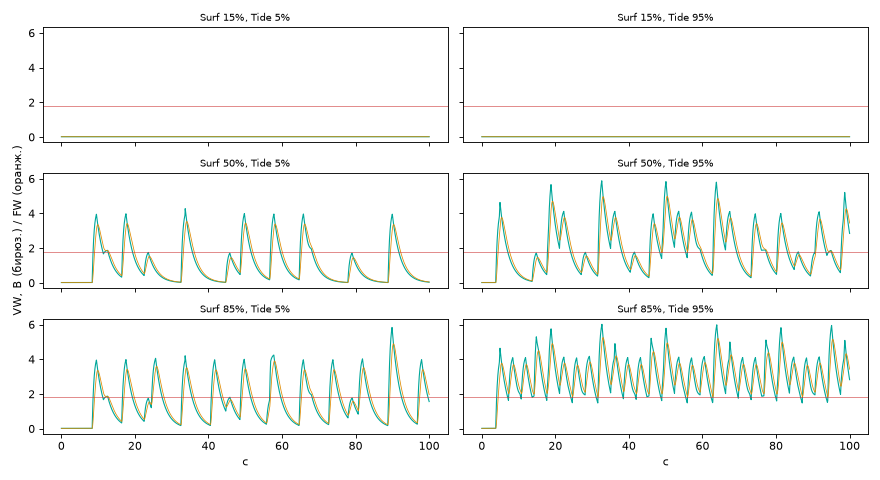

# Surf Synth: паяемая версия

Аналоговый генератор шума прибоя на 12 В, без микроконтроллера. Те же ручки, что на сайте: **Surf**, **Tide**, **Tone**, **Volume**, кнопка питания и светодиод, который вспыхивает на гребне волны.

> **Статус.** Схема нарисована и проверена в симуляции (ngspice, упрощённые модели). Печатная плата не разведена, устройство не собиралось. Всё, что здесь описано как «проверено», проверено только на модели. Подробности в разделе «Что не проверено».



## Что в папке

| Файл | Что это |
|---|---|
| `out/sheet-1…4-*.svg` | Принципиальная схема, 4 листа |
| `out/bom.csv` | Список деталей (122 штуки, 65 позиций) и то, что нужно кроме них |
| `out/nets.csv` | Список соединений: цепь → выводы |
| `out/surf-synth.net` | Список соединений в формате KiCad (для разводки платы; в KiCad не открывалась) |
| `out/surf-synth.cir` | SPICE-модель для ngspice |
| `out/hardware.json` | Данные для 3D-вида «Внутри» на сайте |
| `docs/sim-*.png` | Графики проверки |
| `tools/` | Python-скрипты: схема → всё остальное |

## Как это устроено

1. **Источник шума.** У транзистора 2N3904 (Q1) эмиттер подключён через 10 кОм к +11 В, база и коллектор на землю: переход эмиттер-база пробивается при 6–10 В и шумит. Усилитель U1A (усиление 6…106, подстройка RV1) даёт белый шум 100–150 мВ.
2. **Розовый шум.** R9 и три RC-цепи R10C9, R11C10, R12C11 дают наклон −3 дБ на октаву, затем усилитель U1B.
3. **Волны.** Два мультивибратора (U3A, U3B) с разными периодами и одним сдвоенным потенциометром Tide выдают импульсы ≈1,2 с с периодом 3,5…11 с. Компаратор U4A сравнивает шум с порогом от Surf. Триггер U5 запоминает результат по фронту часов. Вентиль U9 пропускает импульс, только если бит равен 1. Звено R–D–C формирует волну: быстрый подъём, медленный спад (напряжение VW). Вторая цепочка R–C задерживает его для пены (FW). Случайность даёт шум, поэтому волны не повторяются.
4. **Звук.** U6A (фильтр нижних частот на OTA) открывается напряжением VW: на гребне звук ярче. U6B — усилитель, громкость растёт с VW. U7A усиливает белый шум, пропущенный через фильтр верхних частот (пена), с задержкой. U2A складывает слои, Volume и LM386 выводят звук на динамик 8 Ом.

Ручки: **Surf** — как часто и как сильно бегут волны; **Tide** — как часто (по часовой стрелке чаще); **Tone** — базовая яркость; **Volume** — громкость.

## Питание и важные решения

- Блок питания **12 В, центр «+»**, ≥ 500 мА. Шумовому транзистору нужно > 8 В, от батареи 9 В он работал бы на пределе.
- **LM386 берите N-3 или N-4**: у N-1 предел 12 В.
- Диод D1 защищает от неверной полярности. Шина A12 (R1 22 Ом + C3) отделяет малошумящую часть от усилителя мощности.
- Искусственная «земля» VB = 6 В (R2, R3 по 2,2 кОм и C5 220 мкФ): низкий импеданс нужен, потому что на неё возвращаются токи цепей генератора волн.
- На плате все детали ставятся **с задней стороны**, а потенциометры, кнопка и светодиод — с лицевой и паяются со стороны деталей.

## Сборка и настройка

См. вкладку «Сборка» в приложении (кнопка «Внутри» на сайте) или `src/ui/guide.js`. Коротко: сначала напряжения без микросхем (V12 ≈ 11,8 В, A12 ≈ 11,7 В, VB ≈ 5,8 В), потом микросхемы, потом RV1 по уровню шума на выходе W и RV2 по частоте волн.

## Что проверено в симуляции





| Что | Результат |
|---|---|
| Режим по постоянному току | V12 11,77 В, A12 11,70 В, VB 5,85 В, выход LM386 5,88 В |
| Розовый фильтр | наклон −3,03 дБ/окт., отклонение ±0,26 дБ в диапазоне 30 Гц…16 кГц |
| Срез U6A | 258 Гц в паузе (Tone посередине), 890 Гц при 2,5 В, 2,6 кГц при 5,5 В на VW |
| Диапазон Tone | базовый срез ≈ 90…480 Гц |
| Уровень | смеситель 5 мВ в паузе → 117 мВ на гребне; на динамике 0,08 → 1,5 В ср.-кв. (≈ 0,3 Вт) |
| Генератор волн | период часов 3,5 и 4,5 с (Tide на максимуме), 8 и 11 с (на минимуме); 4…17 волн в минуту, зависит от Surf и Tide |

## Что не проверено

- **Плата не разведена.** Расположение деталей в 3D — компоновка для наглядности: все 115 деталей умещаются на 104 × 94 мм, но трассировки нет. Список `surf-synth.net` можно взять за основу в KiCad; автор его там не открывал.
- **Устройство не собиралось.** Шум Q1, смещение нуля у LM13700, ток потребления (оценка 40–60 мА без динамика) — по справочным данным.
- **Упрощённые модели.** ОУ и OTA заданы формулами, поэтому искажения и реальный шум не оценивались. Возможны щелчки в моменты волн из-за смещения нуля в U6: в таком случае нужна подстройка смещения, в схему она не входит.
- Модель CD4013 и CD4081 идеальная, без разброса порогов. Входное напряжение «1» для КМОП при питании 11,7 В — минимум 8 В; выход LM324 и LM358 даёт около 10 В, запас небольшой.

## Как пересобрать

```bash
pip install numpy scipy matplotlib       # только для графиков
sudo apt install ngspice                 # только для проверки
python3 hardware/tools/build.py          # схема → svg, bom, nets, kicad, json
python3 hardware/tools/blocks.py         # структурная схема
python3 hardware/tools/verify_all.py     # симуляция (несколько минут)
```

Правки вносятся в `hardware/tools/circuit.py`: схема — единственный источник, остальное из неё выводится. Сначала запускается проверка правил (ERC).
